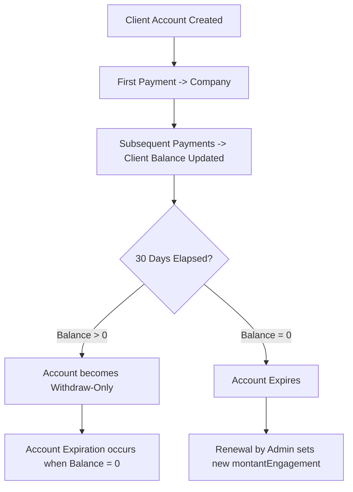
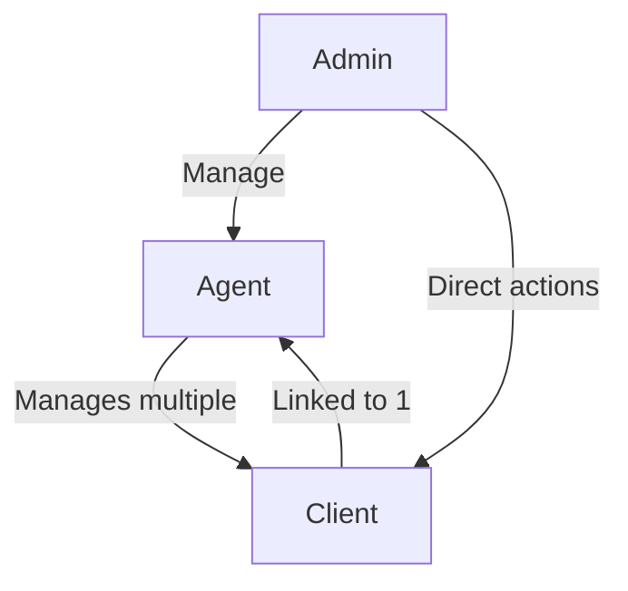
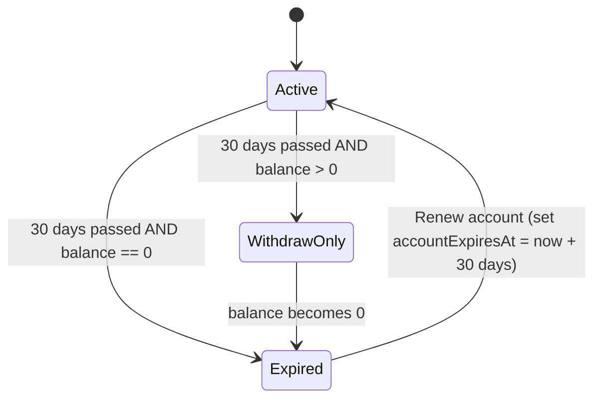

# 🏦 Micro Banking Core

A **local-first banking application** for small-scale banking operations with a single administrative user.
This system allows managing agents, clients, and client accounts with strict business rules around engagement payments, account expiration, and renewals.

---

## 📚 Table of Contents

- [Features](#features)
- [Business Rules](#business-rules)
- [User Roles](#user-roles)
- [Account Lifecycle](#account-lifecycle)
- [Diagrams](#diagrams)
- [Technical Stack](#technical-stack)
- [Architecture](#architecture)
- [Prerequisites](#prerequisites)
- [Installation](#installation)
- [Development](#development)
- [Build Commands](#build-commands)
- [Validation Status](#validation-status)
- [CI/CD](#cicd)
- [Versioning and Release](#versioning-and-release)
- [Repository Structure](#repository-structure)
- [Contributing](#contributing)
- [License](#license)

---

## ✨ Features

- Local-first architecture with SQLite database and migration support.
- Full admin control over agents and clients.
- Client accounts with fixed engagement amounts and strict payment rules.
- Automatic account expiration and renewal.
- Centralized accounting and transaction history.
- Frontend dashboard with charts and statistics.
- Security: DoS protection, token-based authentication, and rate-limited API.

---

## 📜 Business Rules

1. **Client Engagement**
   - Each client has a **`montantEngagement`** (fixed engagement amount).
   - Payments must **exactly match** the engagement amount. Partial payments are not allowed.

2. **Payment Schedule**
   - Clients can pay **any day within a 30-day period**.
   - The first payment at client creation goes directly to the company.
   - Subsequent payments are credited to the client account.
   - Renewal fees follow the same rules: they go to the company and reset the engagement amount.

3. **Account Expiration**
   - If a client account is empty (balance = 0) and **30 days elapse**, the account expires automatically.
   - Expired accounts can be renewed by the admin, setting a new engagement period.
   - If a client deposits money after creation/reactivation and the 30 days elapse, the account switches to **withdraw-only**, blocking new deposits.
   - The account fully expires once the balance reaches 0, or if it is 0 and the 30 days have elapsed.

4. **Agent-Client Relationship**
   - A client is linked to **one agent**.
   - An agent can have **multiple clients**.

---

## 👥 User Roles

1. **Admin**
   - Create, edit, or delete agents and clients.
   - Deposit or withdraw from any client account.
   - Full access to accounting and statistics.

2. **Agent**
   - Assigned to multiple clients.
   - Can monitor clients’ accounts and transactions.

3. **Client**
   - Has a personal account with a fixed engagement amount.
   - Makes payments according to the rules above.

---

## 🏦 Account Lifecycle



---

## 📊 Diagrams

### 1️⃣ Admin → Agent → Client Relationship



### 2️⃣ State View



---

## 🛠 Technical Stack

- **Desktop Shell:** Tauri (Rust)
- **Backend:** Bun + Express + Prisma + SQLite
- **Frontend:** React + TypeScript + Vite + Tailwind + DaisyUI
- **Package Manager:** Bun
- **Security:** express-rate-limit, token-based authentication

---

## 🧩 Architecture

Monorepo structure:
- `client/` — frontend UI
- `server/` — backend API
- `desktop/` — Tauri desktop host + sidecar launcher

Backend packaging strategy:
- No `bun build --compile` for server sidecar
- Runtime packaged as:
  - `server/dist`
  - `server/node_modules` (including `.prisma` and `@prisma/client`)
  - `server/prisma/migrations`
- Sidecar execution: `bun dist/index.js`

Windows packaging:
- NSIS `currentUser` installer mode to avoid `Program Files` permission issues.

---

## ⚙️ Prerequisites

- Bun (latest stable)
- Rust toolchain (stable)
- Platform dependencies for Tauri build:
  - **Windows:** MSVC Build Tools
  - **Linux:** GTK/WebKit2GTK development packages
  - **macOS:** Xcode Command Line Tools

---

## ⚙️ Installation

```bash
# Clone the repository
git clone https://github.com/niagnouma/micro-banking-core.git
cd micro-banking-core

# Install monorepo dependencies
bun install

# Optional explicit installs
(cd client && bun install)
(cd server && bun install)
```

---

## 🧪 Development

`⚠️ Current status:` development mode is currently broken and not considered reliable.
Use bundled production builds for validation until dev mode is fixed.

```bash
# Frontend dev server
cd client
bun run dev

# Backend dev server
cd ../server
bun run dev
```

---

## 🏗️ Build Commands

From repository root:

```bash
# Windows bundle (NSIS)
bun run build:win

# Linux bundles
bun run build:linux

# macOS bundles
bun run build:mac
```

These scripts orchestrate:
1. client production build
2. backend runtime staging for Tauri resources
3. sidecar binary staging (`bun`)
4. Tauri bundle generation

---

## ✅ Validation Status

Current executable validation coverage:

- `Windows (NSIS .exe)`: tested on Windows 10 VM and on a physical Windows machine.
- `macOS (.app/.dmg)`: build available, executable not fully validated on a physical Mac.
- `Linux (.rpm/.deb)`: artifacts generated, executable not validated on physical Linux machines.

Reason:
- limited access to physical test machines and time constraints.

---

## 🔁 CI/CD

### CI Checks
File: `.github/workflows/ci.yml`

Runs on `push` (main), `pull_request` (main), and manual dispatch:
- 🎨 Client checks (lint, type-check, prettier, build)
- ⚙️ Server checks (prisma generate, lint, type-check, prettier, build)
- 🦀 Desktop Rust checks (fmt, clippy, tests)

### Multi-platform Build
File: `.github/workflows/build-multi-platform.yml`

Builds desktop bundles for:
- 🐧 Linux
- 🪟 Windows
- 🍎 macOS

Uploads OS-specific artifacts for each run.

### Tag-driven Release
File: `.github/workflows/release-tag.yml`

Trigger:
- push tags matching `v*`
- manual dispatch

Builds all platforms and publishes GitHub Release assets.

---

## 🏷️ Versioning and Release

Current line:
- App version: `0.0.1`
- Cargo version: `0.0.1`
- Release tag format: `v*` (recommended: `v0.0.1`)

Example release flow:

```bash
git checkout main
git pull origin main
git tag v0.0.1
git push origin v0.0.1
```

---

## 🗂 Repository Structure

```text
.
├── client/
├── server/
├── desktop/
├── scripts/
└── .github/workflows/
```

---

## 🤝 Contributing

- Fork the repository and create a branch for your feature or fix.
- Follow the existing code style and commit conventions.
- Make atomic commits with clear messages.
- Submit a pull request for review.
- See full guidelines in `CONTRIBUTING.md`.
- Community standards are defined in `CODE_OF_CONDUCT.md`.
- Vulnerability reporting is defined in `SECURITY.md`.

---

## 📄 License

MIT License.
