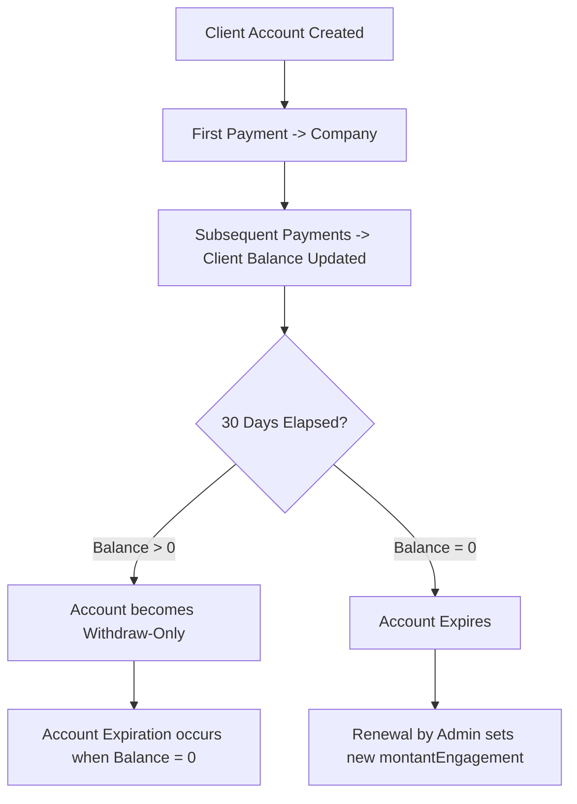
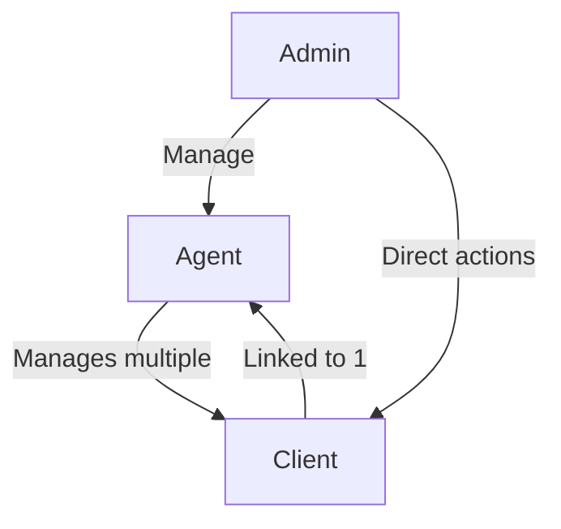

# 🏦 Micro Banking Core

A **local-first banking application** for small-scale banking operations with a single administrative user.  
This system allows managing agents, clients, and client accounts with strict business rules around engagement payments, account expiration, and renewals.

---

## 📚 Table of Contents

- [Features](#features)
- [Business Rules](#business-rules)
- [User Roles](#user-roles)
- [Account Lifecycle](#account-lifecycle)
- [Diagrams](#diagrams)
- [Technical Stack](#technical-stack)
- [Installation](#installation)
- [Usage](#usage)
- [Contributing](#contributing)
- [License](#license)

---

## ✨ Features

- Local-first architecture with SQLite database and optional migration support.
- Full admin control over agents and clients.
- Client accounts with fixed engagement amounts and strict payment rules.
- Automatic account expiration and renewal.
- Centralized accounting and transaction history.
- Frontend dashboard with charts and statistics.
- Security: DoS protection, token-based authentication, and rate-limited API.

---

## 📜 Business Rules

1. **Client Engagement**
   - Each client has a **`montantEngagement`** (fixed engagement amount).
   - Payments must **exactly match** the engagement amount. Partial payments are not allowed.

2. **Payment Schedule**
   - Clients can pay **any day within a 30-day period**.
   - The first payment at client creation goes directly to the company.
   - Subsequent payments are credited to the client account.
   - Renewal fees follow the same rules: they go to the company and reset the engagement amount.

3. **Account Expiration**
   - If a client account is empty (balance = 0) and **30 days elapse**, the account expires automatically.
   - Expired accounts can be renewed by the admin, setting a new engagement period.
   - If a client deposits money after creation/reactivation and the 30 days elapse, the account switches to **withdraw-only**, blocking new deposits.
   - The account fully expires once the balance reaches 0, or if it is 0 and the 30 days have elapsed.

4. **Agent-Client Relationship**
   - A client is linked to **one agent**.
   - An agent can have **multiple clients**.

---

## 👥 User Roles

1. **Admin**
   - Create, edit, or delete agents and clients.
   - Deposit or withdraw from any client account.
   - Full access to accounting and statistics.

2. **Agent**
   - Assigned to multiple clients.
   - Can monitor clients’ accounts and transactions.

3. **Client**
   - Has a personal account with a fixed engagement amount.
   - Makes payments according to the rules above.

---

## 🏦 Account Lifecycle



---

## 📊 Diagrams

### 1️⃣ Admin → Agent → Client Relationship



---

## 🛠 Technical Stack

- **Backend:** Node.js + Express + SQLite
- **Frontend:** React + TypeScript
- **Package Manager:** Bun (official project standard)
- **Security:** express-rate-limit, token-based authentication
- **Database Migrations:** PRAGMA checks for schema updates

---

## ⚙️ Installation

```bash
# Clone the repository
git clone https://github.com/niagnouma/micro-banking-core.git
cd micro-banking-core

# Remove old node_modules and lockfiles
rm -rf node_modules
rm -f package-lock.json pnpm-lock.yaml

# Install dependencies using Bun
bun install

# Run the backend server
bun run server/src/app.ts

# Run the frontend (if applicable)
bun run client/src/main.tsx
```

---

## 🚀 Usage

- Admin logs in to access the dashboard.
- Create agents and clients via the admin interface.
- Monitor payments, account status, and renewals.
- Access accounting stats for the entire system.

---

## 🤝 Contributing

- Fork the repository and create a branch for your feature or fix.
- Follow the existing code style and commit conventions.
- Make atomic commits with clear messages.
- Submit a pull request for review.

---

## 📄 License

This project is open source under the MIT License.
